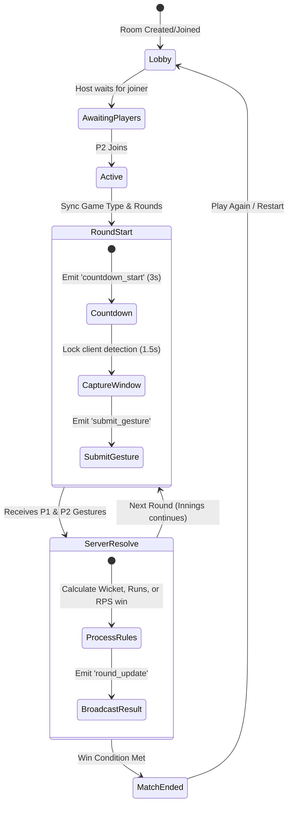

# 📚 HandBattle — Technical Documentation

This document provides an in-depth technical analysis of the HandBattle architecture, tracking systems, gesture detection algorithms, multiplayer state machine, and audio rendering.

---

## 1. Core Architecture Design

HandBattle utilizes a **client-side first** paradigm. Hand tracking, visual rendering, and audio synthesis occur entirely on the client's device inside the web browser. The backend server acts strictly as an orchestrator for online lobby rooms, routing player inputs and state updates without ever touching video files or streams.

### Architecture Comparison: Server-Side vs. Client-Side

| Metric | Server-Side CV (OpenCV + Python) | Client-Side CV (MediaPipe WASM + TS) [Implemented] |
| :--- | :--- | :--- |
| **Video Bandwidth** | Very High (requires uploading webcam streams) | None (video stays local) |
| **Latency** | 100ms - 300ms (network round trip + model run) | ~15ms - 30ms (local CPU/GPU execution) |
| **Server Cost** | Extremely High (requires GPU servers for inference) | Free (static hosting, lightweight Socket.IO server) |
| **User Privacy** | Low (video frames sent to third-party server) | High (video never leaves the device) |
| **Offline Play** | Impossible | Supported (via Vs AI and Local Split-Screen modes) |

---

## 2. Browser Gesture Recognition Engine

The core gesture recognition is implemented inside [useMediaPipe.ts](file:///home/senu/PROJECTS/HandBattle/src/hooks/useMediaPipe.ts) and [gestureClassifier.ts](file:///home/senu/PROJECTS/HandBattle/src/utils/gestureClassifier.ts).

### 2.1 MediaPipe Hands landmark schema

Google MediaPipe Hands returns an array of **21 landmarks** for each detected hand. Each landmark has coordinates normalized to `[0.0, 1.0]` representing `x` and `y`, plus a depth factor `z`.

```
          8   12   16   20
          |    |    |    |
          7   11   15   19
          |    |    |    |
      4   6   10   14   18
       \  |    |    |    |
        3 5----9---13---17
         \             /
          2           /
           \         /
            1       /
             \     /
              \   /
                0 (Wrist)
```

### 2.2 Mathematical Classification Logic

```typescript
// 1. Palm Size Reference
// Calculates a reference distance to scale all thresholds relative to the user's hand distance from camera.
const palmSize = getDistance(wrist[0], middleFingerMCP[9]);
```

#### A. Standard Fingers (Index, Middle, Ring, Pinky)
To determine if a finger is extended ("Up"), we measure whether the fingertip is further away from the wrist than the corresponding PIP joint:

$$\text{Distance}(\text{Tip}, \text{Wrist}) > \text{Distance}(\text{PIP}, \text{Wrist})$$

For the index finger:
```typescript
const isIndexUp = getDistance(landmarks[8], landmarks[0]) > getDistance(landmarks[6], landmarks[0]);
```

#### B. Thumb Classification
The thumb moves along a horizontal plane rather than vertical. We detect extension by comparing the distance between the thumb tip and the index knuckle to a fraction of the palm reference size:

```typescript
const thumbTipToIndexKnuckle = getDistance(landmarks[4], landmarks[5]);
const isThumbUp = thumbTipToIndexKnuckle > palmSize * 0.45 &&
                  getDistance(landmarks[4], landmarks[2]) > palmSize * 0.35;
```

### 2.3 Gesture Mappings

| Pose | Active Fingers Count | Specific Finger Rules | Classified Action |
| :--- | :---: | :--- | :--- |
| **Fist** | 0 | All fingers down | Rock (RPS) / 6 runs (Cricket) |
| **Open Palm** | 5 | All fingers up | Paper (RPS) / 5 runs (Cricket) |
| **Scissors** | 2 | Index + Middle up, others down | Scissors (RPS) / 2 runs (Cricket) |
| **Other Poses** | 1, 3, 4 | Normal count mapping | N runs (Cricket) / Unknown (RPS) |

### 2.4 Noise Filtering & Debouncing
To prevent classification flickering while the player moves their hand:
1.  Landmarks are collected over a rolling buffer of 10 frames.
2.  A helper function (`getStableGesture`) calculates the modal value of this buffer.
3.  A gesture is locked in only if it remains consistent for at least **5 frames** in history.

---

## 3. Multiplayer State Machine & Networking

Online multiplayer is managed by [server.js](file:///home/senu/PROJECTS/HandBattle/server/server.js) using WebSockets (Socket.IO).



### Socket Event Dictionary

| Event (from client) | Payload | Server Action |
| :--- | :--- | :--- |
| `createRoom` | `{ name: string }` | Generates a 6-digit room code, joins socket channel. |
| `joinRoom` | `{ roomId: string, name: string }` | Attaches socket to room, notifies room host. |
| `startGame` | `{ gameType: 'cricket'\|'rps' }` | Initializes game state structures on the room. Starts countdown. |
| `submitGesture` | `{ gesture: string, fingerCount: number }` | Saves input. Triggers logic once both inputs are loaded. |
| `rematch` | — | Resets game counters, swaps roles if Cricket, and loops back to start. |

| Event (from server) | Payload | Client Action |
| :--- | :--- | :--- |
| `roomState` | `{ players: [...], gameType: ... }` | Re-renders UI lobby list and settings panels. |
| `countdown` | `{ count: number }` | Overlays visual 8-bit count (3.. 2.. 1.. SHOW!). |
| `roundResult` | `{ p1Choice, p2Choice, scoreData, msg }` | Triggers boundary animation, audio synth, and adjusts scoreboard. |
| `gameOver` | `{ winner: string, reason: string }` | Stops active loop, plays win/lose sound, overlays retry prompt. |

---

## 4. Retro Audio Synthesizer Engine

To avoid loading heavy audio sample files over slow connections, HandBattle generates sound effects in real-time using the **Web Audio API** via [audioSynth.ts](file:///home/senu/PROJECTS/HandBattle/src/utils/audioSynth.ts).

### Dynamic Sound Generators

*   **Tick Sound (Countdown):**
    *   Generates a short sine wave beep at 800Hz decaying over 0.05 seconds.
*   **Out Sound (Cricket Wicket):**
    *   Synthesizes a descending square wave starting at 300Hz down to 80Hz combined with a low-frequency oscillator (LFO) to simulate disappointment.
*   **Boundary Sound (4 / 6 Runs):**
    *   A bright triangle wave sequence at 600Hz and 1200Hz that rapidly pulses to mimic retro arcade crowds cheering.
*   **Match Win Fanfare:**
    *   A major-chord arpeggio sequence using square wave oscillators (C5 -> E5 -> G5 -> C6) spaced at 0.15s intervals.
*   **Match Loss Theme:**
    *   A minor-chord sliding sound descending from Eb4 to C3 with a low gain.
